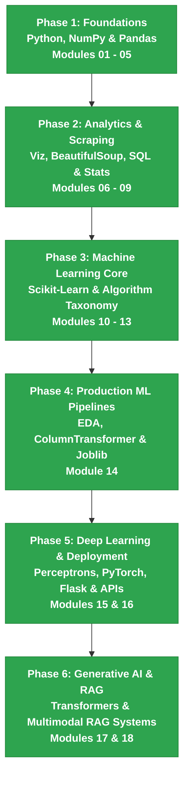

# 📊 Data Science, ML & AI Learning Journey

### _Complete Masterclass: From Python Foundations to Production ML, Deep Learning & Multimodal RAG Systems_

 

 

 

 

[🏆 Milestone](#-completion-milestone) • [🌟 About](#-about-this-course) • [📚 Curriculum](#-curriculum) • [🚀 Roadmap](#-mastery-roadmap) • [🎯 Projects](#-capstone-projects) • [💡 Skills](#-skills-unlocked) • [🤝 Connect](#-connect)

---

## 🏆 Completion Milestone

> [!IMPORTANT]
> ### 🎯 OFFICIAL COURSE GRADUATION ANNOUNCEMENT
> This comprehensive Data Science, Machine Learning & Artificial Intelligence curriculum has been **100% fully completed**!

| Metric | Details |
| :--- | :--- |
| 🚀 **Start Date** | **September 14, 2025** |
| 🎉 **Completion Date** | **August 04, 2026** |
| ⏱️ **Total Learning Duration** | **11 Months (~46 Weeks of Intensive Study)** |
| 📚 **Total Modules Mastered** | **18 Out of 18 Modules (100%)** |
| 📓 **Jupyter Notebooks** | **60+ Interactive Code Notebooks** |
| 💻 **Code & Media Resources** | **200+ Scripts, SQL Guides, Data Files & Models** |
| 🏆 **Graduation Status** | **GRADUATED — GOD LEVEL MASTERY ACHIEVED** |

---

## 🌟 About This Course

Welcome to the complete record of my **Data Science & AI Learning Journey**! 

This repository documents an intensive, hands-on journey from the absolute basics of Python programming to building production-grade Machine Learning pipelines, Deep Learning neural networks, web-deployed model APIs, and modern Multimodal RAG (Retrieval-Augmented Generation) AI systems.

### 💡 What Makes This Repository Special?

- 🎯 **100% Practical & Project-Driven:** Every concept is backed by working Python code, Jupyter notebooks, or real-world datasets.
- 🧱 **End-to-End Skill Building:** From simple `if/else` loops to full `ColumnTransformer` pipelines, Flask web applications, and vector embedding audio/video RAG pipelines.
- 📁 **Structured & Clean Architecture:** Organized into 18 logical modules covering Data Analytics, SQL, Statistics, Machine Learning, Deep Learning, Web Dev, and Generative AI.

---

## 📚 Curriculum

### 📖 All 18 Completed Modules

<table>
<tr>
<th width="5%">No.</th>
<th width="22%">Module Name</th>
<th width="38%">Key Topics Covered</th>
<th width="15%">Content Summary</th>
<th width="20%">Status</th>
</tr>

<tr>
<td align="center">01</td>
<td><b>🎓 <a href="file:///d:/VsCode/DATA%20SCIENCE%20COURSE/001%20Data%20Science%20Intro">Data Science Intro</a></b></td>
<td>Tools, Environment Setup, Data Science Lifecycle, Career Paths</td>
<td>1 PDF Guide</td>
<td align="center">✅ <b>COMPLETED</b></td>
</tr>

<tr>
<td align="center">02</td>
<td><b>🐍 <a href="file:///d:/VsCode/DATA%20SCIENCE%20COURSE/002%20Python%20refresher">Python Refresher</a></b></td>
<td>Variables, Loops, Data Structures, Functions, OOP, Lambdas, File I/O, JSON</td>
<td>18 Notebooks + 2 Docs</td>
<td align="center">✅ <b>COMPLETED</b></td>
</tr>

<tr>
<td align="center">03</td>
<td><b>🚀 <a href="file:///d:/VsCode/DATA%20SCIENCE%20COURSE/003%20Project%20001%20-%20Coders%20of%20Delhi">Project: Coders of Delhi</a></b></td>
<td>Social Graph Theory, Recommendation Engine (People You May Know)</td>
<td>3 Notebooks + Datasets</td>
<td align="center">✅ <b>COMPLETED</b></td>
</tr>

<tr>
<td align="center">04</td>
<td><b>🔢 <a href="file:///d:/VsCode/DATA%20SCIENCE%20COURSE/004%20NumPy">NumPy Mastery</a></b></td>
<td>NDArrays, Indexing, Slicing, Broadcasting, Vectorization, Matrix Math</td>
<td>5 Notebooks</td>
<td align="center">✅ <b>COMPLETED</b></td>
</tr>

<tr>
<td align="center">05</td>
<td><b>🐼 <a href="file:///d:/VsCode/DATA%20SCIENCE%20COURSE/005%20Pandas">Pandas Deep Dive</a></b></td>
<td>DataFrames, Series, Data Cleaning, Merging, GroupBy, Aggregation</td>
<td>2 Notebooks + Datasets</td>
<td align="center">✅ <b>COMPLETED</b></td>
</tr>

<tr>
<td align="center">06</td>
<td><b>📊 <a href="file:///d:/VsCode/DATA%20SCIENCE%20COURSE/006%20Matplotlib%20and%20Seaborn">Data Visualization</a></b></td>
<td>Bar, Line, Scatter, Pie, Histograms, Boxplots, Heatmaps, Subplots</td>
<td>8 Notebooks + PDF</td>
<td align="center">✅ <b>COMPLETED</b></td>
</tr>

<tr>
<td align="center">07</td>
<td><b>🕷️ <a href="file:///d:/VsCode/DATA%20SCIENCE%20COURSE/007%20Web%20Scrapping">Web Scraping</a></b></td>
<td>HTTP Protocol, BeautifulSoup4, Requests, DOM Traversal, Scraping Pipelines</td>
<td>2 Notebooks + 49 HTMLs</td>
<td align="center">✅ <b>COMPLETED</b></td>
</tr>

<tr>
<td align="center">08</td>
<td><b>🗄️ <a href="file:///d:/VsCode/DATA%20SCIENCE%20COURSE/008%20Databases">SQL & Databases</a></b></td>
<td>CRUD Operations, Complex Joins, Subqueries, Views, Indexes, Stored Procedures</td>
<td>20 SQL Guides</td>
<td align="center">✅ <b>COMPLETED</b></td>
</tr>

<tr>
<td align="center">09</td>
<td><b>📈 <a href="file:///d:/VsCode/DATA%20SCIENCE%20COURSE/009%20Probability">Probability & Stats</a></b></td>
<td>Conditional Probability, Bayes Theorem, Uniform, Binomial & Normal Dist, CLT</td>
<td>13 Guides & Scripts</td>
<td align="center">✅ <b>COMPLETED</b></td>
</tr>

<tr>
<td align="center">10</td>
<td><b>🤖 <a href="file:///d:/VsCode/DATA%20SCIENCE%20COURSE/010%20Machine%20Learning%20for%20Data%20Scientists">ML Introduction</a></b></td>
<td>Machine Learning Fundamentals, ML History, How Machines Learn Concepts</td>
<td>PPT & Study Guides</td>
<td align="center">✅ <b>COMPLETED</b></td>
</tr>

<tr>
<td align="center">11</td>
<td><b>🔧 <a href="file:///d:/VsCode/DATA%20SCIENCE%20COURSE/011%20sklearn%20demo">Sklearn Basics</a></b></td>
<td>First ML Models, Estimators API, Decision Trees, Model Selection</td>
<td>3 Notebooks + PDF</td>
<td align="center">✅ <b>COMPLETED</b></td>
</tr>

<tr>
<td align="center">12</td>
<td><b>📋 <a href="file:///d:/VsCode/DATA%20SCIENCE%20COURSE/012%20Types%20of%20ML%20Algorithms">ML Algorithm Types</a></b></td>
<td>Supervised vs. Unsupervised, Classification, Regression, Clustering Overview</td>
<td>3 Concept Guides</td>
<td align="center">✅ <b>COMPLETED</b></td>
</tr>

<tr>
<td align="center">13</td>
<td><b>🎯 <a href="file:///d:/VsCode/DATA%20SCIENCE%20COURSE/013%20Demo%20Practice%20ML%20using%20Scikit%20Learn">Demo ML Practice</a></b></td>
<td>Iris Classification, Accuracy Metrics, Train-Test Split, RMSE & MAE Evaluation</td>
<td>6 Notebooks + Datasets</td>
<td align="center">✅ <b>COMPLETED</b></td>
</tr>

<tr>
<td align="center">14</td>
<td><b>🛠️ <a href="file:///d:/VsCode/DATA%20SCIENCE%20COURSE/014%20Practical%20ML%20using%20Scikit-learn">Practical ML & Pipelines</a></b></td>
<td>EDA, Imputation, One-Hot Encoding, Feature Scaling, ColumnTransformer, Joblib</td>
<td>10 Notebooks + Scripts</td>
<td align="center">✅ <b>COMPLETED</b></td>
</tr>

<tr>
<td align="center">15</td>
<td><b>🧠 <a href="file:///d:/VsCode/DATA%20SCIENCE%20COURSE/015%20Deep%20Learning%20%26%20Neural%20Networks">Deep Learning & Neural Nets</a></b></td>
<td>Perceptron Formula, Neural Network Architecture, PyTorch vs. TensorFlow, MNIST</td>
<td>2 Notebooks + Scripts</td>
<td align="center">✅ <b>COMPLETED</b></td>
</tr>

<tr>
<td align="center">16</td>
<td><b>🌐 <a href="file:///d:/VsCode/DATA%20SCIENCE%20COURSE/016%20Web%20Development%20for%20Data%20Scientists">Web Dev for Data Science</a></b></td>
<td>HTML5, CSS3, Flask Application Routing, Jinja Templates, Dynamic APIs</td>
<td>20 Web App Files</td>
<td align="center">✅ <b>COMPLETED</b></td>
</tr>

<tr>
<td align="center">17</td>
<td><b>🤖 <a href="file:///d:/VsCode/DATA%20SCIENCE%20COURSE/017%20LLM%20Intro">LLM & GenAI Intro</a></b></td>
<td>LLM Architecture, Transformers, Tokenization, Prompt Engineering, RAG Concepts</td>
<td>5 Guides & PDF</td>
<td align="center">✅ <b>COMPLETED</b></td>
</tr>

<tr>
<td align="center">18</td>
<td><b>🎙️ <a href="file:///d:/VsCode/DATA%20SCIENCE%20COURSE/018%20RAG%20based%20Al%20Teaching">Multimodal RAG AI Teaching</a></b></td>
<td>Audio/Video Ingestion, Media Preprocessing, Chunking, Vector Search & Embeddings</td>
<td>54 Code & Media Files</td>
<td align="center">✅ <b>COMPLETED</b></td>
</tr>
</table>

---

## 🚀 Mastery Roadmap

Below is the visual progression of how this course unfolded over 11 months across 6 major learning phases:

<b>🔍 Phase-by-Phase Deep Dive (Click to expand)</b>

 

### 🌱 Phase 1: Foundations (Python & Data Basics)
- Mastered Python core syntax, control flow, functions, OOP, and lambda expressions.
- Learned fast numerical computations with NumPy NDArrays, vectorization, and matrix operations.
- Deep dived into Pandas DataFrames for data loading, indexing, cleaning, and aggregation.
- Built the **Coders of Delhi** social network graph recommendation engine.

### 🌿 Phase 2: Analytics, Web Harvesting & SQL
- Mastered data visualization using Matplotlib (bar, line, scatter, box plots) and Seaborn heatmaps.
- Built automated web scraping pipelines using `requests` and `BeautifulSoup4` over 49+ web pages.
- Covered relational databases in MySQL: complex JOINs, foreign keys, window functions, and stored procedures.
- Studied mathematical foundations: Bayes Theorem, Binomial, Normal distributions, and Central Limit Theorem.

### 🌳 Phase 3: Machine Learning Core
- Understood the core philosophies of machine learning: Supervised vs. Unsupervised learning.
- Implemented Scikit-Learn estimators, Decision Trees, and model evaluation metrics (Accuracy, Confusion Matrix).
- Practiced end-to-end model training on the Iris dataset with train-test splits and error metrics (RMSE, MAE).

### 🛠️ Phase 4: Production ML Pipelines
- Implemented real-world Exploratory Data Analysis (EDA) on house prices and smartphone datasets.
- Created robust feature engineering pipelines using `ColumnTransformer` (SimpleImputer, OneHotEncoder, StandardScaler).
- Learned model serialization and offline inference using `Joblib`.

### 🧠 Phase 5: Deep Learning & Web Deployment
- Understood artificial neural network foundations, Perceptron formulas, and PyTorch vs. TensorFlow architectures.
- Built neural network classifiers for handwritten digit recognition on the MNIST dataset.
- Developed full-stack Flask web applications with Jinja2 template inheritance, custom HTML/CSS, dynamic forms, and REST APIs to deploy data science models.

### 🎙️ Phase 6: Generative AI & Multimodal RAG
- Explored Large Language Model (LLM) architectures, Transformers, and vector embeddings.
- Developed an end-to-end **Multimodal RAG AI Teaching Assistant** system that processes educational audio/video files, generates vector embeddings (`embeddings.joblib`), chunks text, and answers student queries contextually.

---

## 🎯 Capstone Projects

<table>
<tr>
<td width="50%">

#### 🎙️ Multimodal RAG AI Teaching System
**Generative AI & Media Processing Pipeline**

An end-to-end RAG system that ingests video/audio educational content, converts media to audio (`video_to_mp3.py`), generates text chunks (`merge_chunks.py`), computes vector embeddings (`embeddings.joblib`), and responds to user queries (`process_incoming.py`).

- **Tech Stack:** Python, OpenAI / LLM Architecture, Vector Search, Joblib, Audio Processing
- **Folder:** [`018 RAG based Al Teaching`](file:///d:/VsCode/DATA%20SCIENCE%20COURSE/018%20RAG%20based%20Al%20Teaching)

</td>
<td width="50%">

#### 🏠 Gurgaon House Price Predictor
**Production Machine Learning Pipeline**

A complete real estate pricing model featuring automated data preprocessing, missing value handling, categorical encoding, feature scaling, and model persistence.

- **Tech Stack:** Scikit-Learn, Pandas, ColumnTransformer, Joblib
- **Folder:** [`014 Practical ML using Scikit-learn/004 Predicting Gurgaon City House Prices`](file:///d:/VsCode/DATA%20SCIENCE%20COURSE/014%20Practical%20ML%20using%20Scikit-learn/004%20Predicting%20Gurgaon%20City%20House%20Prices)

</td>
</tr>
<tr>
<td width="50%">

#### 🌐 Flask Data Science Web Application
**Full-Stack ML Deployment & REST API**

Web applications built with Flask, Jinja2 template inheritance, HTML5/CSS3 UI styling, and RESTful API endpoints for serving machine learning models over the web.

- **Tech Stack:** Flask, Jinja2, HTML5, CSS3, Python REST APIs
- **Folder:** [`016 Web Development for Data Scientists`](file:///d:/VsCode/DATA%20SCIENCE%20COURSE/016%20Web%20Development%20for%20Data%20Scientists)

</td>
<td width="50%">

#### 🌐 Coders of Delhi (Social Graph Engine)
**Graph Recommendation System**

Social network recommendation algorithms built from scratch to calculate "People You May Know" and "Pages You Might Like" based on user similarity matrices.

- **Tech Stack:** Python, JSON Data Structures, Graph Theory
- **Folder:** [`003 Project 001 - Coders of Delhi`](file:///d:/VsCode/DATA%20SCIENCE%20COURSE/003%20Project%20001%20-%20Coders%20of%20Delhi)

</td>
</tr>
<tr>
<td width="50%">

#### 🧠 MNIST Digit Recognizer
**Neural Network & Perceptron Classifier**

Handwritten digit recognition trained using Perceptron formulas and deep neural networks, complete with pixel visualization routines.

- **Tech Stack:** PyTorch, TensorFlow/Keras, Scikit-Learn, Matplotlib
- **Folder:** [`015 Deep Learning & Neural Networks`](file:///d:/VsCode/DATA%20SCIENCE%20COURSE/015%20Deep%20Learning%20%26%20Neural%20Networks)

</td>
<td width="50%">

#### 📚 Book Data Scraping Pipeline
**Web Scraping & Automated Data Extraction**

Harvested 49 HTML pages from an online library, parsed product titles, prices, and ratings with BeautifulSoup, and structured output into clean CSV files.

- **Tech Stack:** Requests, BeautifulSoup4, HTML Parsing, Pandas
- **Folder:** [`007 Web Scrapping`](file:///d:/VsCode/DATA%20SCIENCE%20COURSE/007%20Web%20Scrapping)

</td>
</tr>
</table>

---

## 💡 Skills Unlocked

<table>
<tr>
<td width="33%">

### 🐍 Programming & Data
- ✅ Python Syntax & OOP
- ✅ Lambdas & Map/Filter
- ✅ Data Cleaning & Imputation
- ✅ Pandas DataFrames & GroupBy
- ✅ NumPy Vectorization & Matrices
- ✅ JSON & File I/O Operations

</td>
<td width="33%">

### 🤖 Machine Learning & ML-Ops
- ✅ Supervised & Unsupervised ML
- ✅ Decision Trees & Classifiers
- ✅ Scikit-Learn `ColumnTransformer`
- ✅ One-Hot & Ordinal Encoding
- ✅ StandardScaler & MinMaxScaler
- ✅ Model Persistence with Joblib

</td>
<td width="33%">

### 🧠 Deep Learning & GenAI
- ✅ Perceptron & Neural Networks
- ✅ PyTorch vs. TensorFlow Basics
- ✅ Activations & Loss Functions
- ✅ LLM & Transformer Mechanism
- ✅ Retrieval-Augmented Generation
- ✅ Vector Embeddings & Ingestion

</td>
</tr>
<tr>
<td width="33%">

### 🗄️ SQL & Databases
- ✅ SQL SELECT, JOIN & WHERE
- ✅ Grouping & Aggregations
- ✅ Subqueries & Views
- ✅ Indexes & Query Optimization
- ✅ Foreign Key Constraints
- ✅ MySQL Stored Procedures

</td>
<td width="33%">

### 🌐 Web Dev & Deployment
- ✅ HTML5 & CSS3 Web Layouts
- ✅ Flask Web Server Setup
- ✅ Jinja2 Template Inheritance
- ✅ Dynamic Query Parameters
- ✅ REST API Endpoint Creation
- ✅ Deploying Models to Web UI

</td>
<td width="33%">

### 📊 Visualization & Scraping
- ✅ Matplotlib Custom Plots
- ✅ Seaborn Statistical Graphics
- ✅ BeautifulSoup4 HTML Parsing
- ✅ Automated Web Scraping
- ✅ Multimodal Media Extraction
- ✅ Data Pipeline Engineering

</td>
</tr>
</table>

---

## 🛠️ Technology Stack

| Category | Technology / Framework / Library |
| :--- | :--- |
| **💻 Programming Language** | **Python 3.11+** |
| **📊 Data Analysis & Science** | **NumPy, Pandas** |
| **📈 Data Visualization** | **Matplotlib, Seaborn** |
| **🕷️ Data Scraping & Web** | **BeautifulSoup4, Requests, HTML5, CSS3** |
| **🗄️ Database Management** | **MySQL, SQL** |
| **🤖 Machine Learning** | **Scikit-Learn, Joblib** |
| **🧠 Deep Learning** | **PyTorch, TensorFlow / Keras** |
| **🌐 Web Framework** | **Flask, Jinja2** |
| **🎙️ Generative AI & RAG** | **Transformers, OpenAI API, Vector Embeddings** |
| **📓 IDE & Workspace** | **Jupyter Notebook, VS Code, Git** |

---

## 📈 Progress Tracker

### Core Curriculum Modules (100% Completed!)

- [x] 🎓 Module 01: Data Science Intro
- [x] 🐍 Module 02: Python Refresher (18 Notebooks)
- [x] 🚀 Module 03: Social Network Project (Coders of Delhi)
- [x] 🔢 Module 04: NumPy Mastery (5 Notebooks)
- [x] 🐼 Module 05: Pandas Deep Dive (2 Notebooks)
- [x] 📊 Module 06: Data Visualization (8 Notebooks)
- [x] 🕷️ Module 07: Web Scraping & BeautifulSoup
- [x] 🗄️ Module 08: SQL & Databases (20 Tutorials)
- [x] 📈 Module 09: Probability & Statistics
- [x] 🤖 Module 10: Machine Learning Fundamentals
- [x] 🔧 Module 11: Scikit-Learn Basics
- [x] 📋 Module 12: Types of ML Algorithms
- [x] 🎯 Module 13: Scikit-Learn Practice & Metrics
- [x] 🛠️ Module 14: Practical ML Pipelines & Feature Engineering
- [x] 🧠 Module 15: Deep Learning & Neural Networks
- [x] 🌐 Module 16: Web Development for Data Scientists (Flask)
- [x] 🤖 Module 17: LLM & Generative AI Intro
- [x] 🎙️ Module 18: RAG-based AI Teaching & Multimodal Pipelines

### Capstone Projects (All Finished!)

- [x] 🎙️ Multimodal RAG AI Teaching System
- [x] 🏠 Gurgaon House Price Predictor Pipeline
- [x] 🌐 Flask Web Application & REST API Deployment
- [x] 🌐 Coders of Delhi Social Graph Engine
- [x] 🧠 MNIST Neural Network Digit Recognizer
- [x] 📚 49-Page Web Scraping Data Pipeline

---

## 🤝 Connect & Socials

### Let's Connect & Collaborate!

---

## 📜 License

This project is licensed under the **MIT License** - see the [LICENSE](LICENSE) file for details.

---

### 🏆 COURSE COMPLETED FULLY (Sep 14, 2025 – Aug 04, 2026)

**Made with ❤️ and relentless dedication for Data Science & AI Mastery.**

