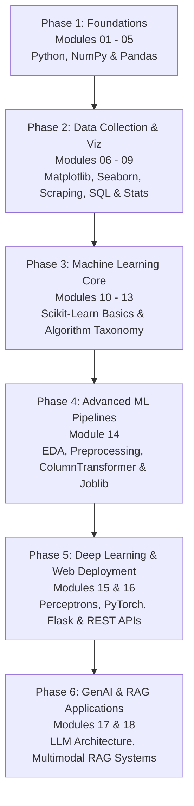

<div align="center">

# 📊 Data Science & AI Learning Journey

### _Master Data Science, Machine Learning, Deep Learning, Web Deployment & Generative AI_

    

     

[](https://github.com/ggauravky/Data-Science-Learning) [](https://github.com/ggauravky/Data-Science-Learning/fork) 

[🚀 Quick Start](#-quick-start) • [📚 Curriculum](#-curriculum) • [🎯 Projects](#-featured-projects) • [💡 Skills](#-skills-youll-gain) • [🛠️ Tech Stack](#️-technology-stack) • [🤝 Connect](#-connect)

</div>

---

## 🌟 About This Course

This repository is an **all-in-one, hands-on Data Science, Machine Learning, and GenAI curriculum** designed to take you from foundational Python to advanced production pipelines, deep learning models, web deployment, and RAG-based AI applications.

Containing **60+ Jupyter Notebooks**, **200+ total resources**, and **real-world projects**, this curriculum covers:

- ✅ **Python Fundamentals & Data Structures** - Object-oriented programming, lambda functions & data manipulation.
- ✅ **Numerical Computing & Data Wrangling** - High-performance arrays with NumPy and DataFrames with Pandas.
- ✅ **Exploratory Data Analysis & Visualization** - Insightful charts with Matplotlib & Seaborn.
- ✅ **Web Scraping & Data Harvesting** - Automated collection with BeautifulSoup & Requests.
- ✅ **Relational Databases & SQL** - Complex queries, joins, window functions & stored procedures.
- ✅ **Probability & Mathematical Foundations** - Bayes theorem, distributions & statistical inference.
- ✅ **Machine Learning & Feature Engineering** - Scikit-Learn pipelines, ColumnTransformer, encoding & scaling.
- ✅ **Deep Learning & Neural Networks** - Perceptron theory, PyTorch vs. TensorFlow, MNIST digit recognition.
- ✅ **Web Development & Model Deployment** - Flask applications, Jinja2 template inheritance & RESTful APIs.
- ✅ **Large Language Models (LLMs) & RAG** - Transformer architecture, prompt engineering & RAG-based AI systems.

**📈 Status:** 🟢 Active & Continuously Updated!

---

## 📚 Curriculum

### 📖 Complete 18-Module Roadmap

<table>
<tr>
<th width="5%">No.</th>
<th width="22%">Module</th>
<th width="38%">Topics Covered</th>
<th width="15%">Content</th>
<th width="20%">Key Focus</th>
</tr>

<tr>
<td align="center">01</td>
<td><b>🎓 <a href="file:///d:/VsCode/DATA%20SCIENCE%20COURSE/001%20Data%20Science%20Intro">Data Science Intro</a></b></td>
<td>Tools, Environment Setup, Data Science Lifecycle, Career Pathways</td>
<td>1 PDF Guide</td>
<td>Foundation Setup</td>
</tr>

<tr>
<td align="center">02</td>
<td><b>🐍 <a href="file:///d:/VsCode/DATA%20SCIENCE%20COURSE/002%20Python%20refresher">Python Refresher</a></b></td>
<td>Variables, Control Flow, Data Structures, Functions, OOP, Lambdas</td>
<td>18 Notebooks</td>
<td>Python Mastery</td>
</tr>

<tr>
<td align="center">03</td>
<td><b>🚀 <a href="file:///d:/VsCode/DATA%20SCIENCE%20COURSE/003%20Project%20001%20-%20Coders%20of%20Delhi">Project: Coders of Delhi</a></b></td>
<td>Graph Theory, Social Network Recommendation Algorithms, JSON Parsing</td>
<td>3 Notebooks</td>
<td>Social Graph AI</td>
</tr>

<tr>
<td align="center">04</td>
<td><b>🔢 <a href="file:///d:/VsCode/DATA%20SCIENCE%20COURSE/004%20NumPy">NumPy Mastery</a></b></td>
<td>NDArrays, Indexing, Slicing, Broadcasting, Vectorization, Matrix Math</td>
<td>5 Notebooks</td>
<td>Numerical Computing</td>
</tr>

<tr>
<td align="center">05</td>
<td><b>🐼 <a href="file:///d:/VsCode/DATA%20SCIENCE%20COURSE/005%20Pandas">Pandas Deep Dive</a></b></td>
<td>DataFrames, Series, Data Cleaning, Merging, GroupBy, Aggregations</td>
<td>2 Notebooks</td>
<td>Data Manipulation</td>
</tr>

<tr>
<td align="center">06</td>
<td><b>📊 <a href="file:///d:/VsCode/DATA%20SCIENCE%20COURSE/006%20Matplotlib%20and%20Seaborn">Data Visualization</a></b></td>
<td>Line, Bar, Scatter Plots, Histograms, Boxplots, Heatmaps, Seaborn Themes</td>
<td>8 Notebooks</td>
<td>Visual Storytelling</td>
</tr>

<tr>
<td align="center">07</td>
<td><b>🕷️ <a href="file:///d:/VsCode/DATA%20SCIENCE%20COURSE/007%20Web%20Scrapping">Web Scraping</a></b></td>
<td>HTTP Protocol, Requests, HTML Parsing, BeautifulSoup, HTML Samples</td>
<td>2 Notebooks + 49 HTMLs</td>
<td>Data Scraping</td>
</tr>

<tr>
<td align="center">08</td>
<td><b>🗄️ <a href="file:///d:/VsCode/DATA%20SCIENCE%20COURSE/008%20Databases">SQL & Databases</a></b></td>
<td>CRUD, Joins, Grouping, Subqueries, Views, Indexes, Stored Procedures</td>
<td>20 SQL Guides</td>
<td>Database Management</td>
</tr>

<tr>
<td align="center">09</td>
<td><b>📈 <a href="file:///d:/VsCode/DATA%20SCIENCE%20COURSE/009%20Probability">Probability & Stats</a></b></td>
<td>Conditional Probability, Bayes Theorem, Probability Distributions, Sampling</td>
<td>13 Guides & Scripts</td>
<td>Statistical Thinking</td>
</tr>

<tr>
<td align="center">10</td>
<td><b>🤖 <a href="file:///d:/VsCode/DATA%20SCIENCE%20COURSE/010%20Machine%20Learning%20for%20Data%20Scientists">ML Introduction</a></b></td>
<td>Machine Learning Basics, ML History, Traditional vs. ML Approaches</td>
<td>PPT & Notes</td>
<td>ML Concepts</td>
</tr>

<tr>
<td align="center">11</td>
<td><b>🔧 <a href="file:///d:/VsCode/DATA%20SCIENCE%20COURSE/011%20sklearn%20demo">Sklearn Basics</a></b></td>
<td>First ML Models, Model Training, Scikit-Learn Estimator API, Evaluation</td>
<td>3 Notebooks</td>
<td>Scikit-Learn Intro</td>
</tr>

<tr>
<td align="center">12</td>
<td><b>📋 <a href="file:///d:/VsCode/DATA%20SCIENCE%20COURSE/012%20Types%20of%20ML%20Algorithms">ML Algorithm Types</a></b></td>
<td>Supervised vs. Unsupervised, Regression, Classification, Clustering Taxonomy</td>
<td>3 Guides</td>
<td>Algorithm Selection</td>
</tr>

<tr>
<td align="center">13</td>
<td><b>🎯 <a href="file:///d:/VsCode/DATA%20SCIENCE%20COURSE/013%20Demo%20Practice%20ML%20using%20Scikit%20Learn">Demo ML Practice</a></b></td>
<td>Iris Classification, Model Metrics, Train-Test Splits, RMSE/MAE Error Metrics</td>
<td>6 Notebooks</td>
<td>Scikit-Learn Practice</td>
</tr>

<tr>
<td align="center">14</td>
<td><b>🛠️ <a href="file:///d:/VsCode/DATA%20SCIENCE%20COURSE/014%20Practical%20ML%20using%20Scikit-learn">Practical ML & Pipelines</a></b></td>
<td>EDA, Imputation, One-Hot Encoding, ColumnTransformer, Joblib Persistence</td>
<td>10 Notebooks + Scripts</td>
<td>Production Pipelines</td>
</tr>

<tr>
<td align="center">15</td>
<td><b>🧠 <a href="file:///d:/VsCode/DATA%20SCIENCE%20COURSE/015%20Deep%20Learning%20%26%20Neural%20Networks">Deep Learning & Neural Nets</a></b></td>
<td>Perceptron Formula, PyTorch vs. TensorFlow, Activations, MNIST Recognition</td>
<td>2 Notebooks + Scripts</td>
<td>Deep Learning</td>
</tr>

<tr>
<td align="center">16</td>
<td><b>🌐 <a href="file:///d:/VsCode/DATA%20SCIENCE%20COURSE/016%20Web%20Development%20for%20Data%20Scientists">Web Dev for Data Science</a></b></td>
<td>HTML5/CSS3, Flask Server, Jinja Templates, Dynamic Forms, RESTful APIs</td>
<td>20 Web Files</td>
<td>Model Deployment</td>
</tr>

<tr>
<td align="center">17</td>
<td><b>🤖 <a href="file:///d:/VsCode/DATA%20SCIENCE%20COURSE/017%20LLM%20Intro">LLM & GenAI Intro</a></b></td>
<td>LLM Architecture, History of LLMs, Transformer Models, Tokenization, RAG</td>
<td>5 Guides & PDFs</td>
<td>Generative AI</td>
</tr>

<tr>
<td align="center">18</td>
<td><b>🎙️ <a href="file:///d:/VsCode/DATA%20SCIENCE%20COURSE/018%20RAG%20based%20Al%20Teaching">Multimodal RAG AI Teaching</a></b></td>
<td>Video & Audio Processing, Transcription, Vector Search, AI Teaching System</td>
<td>Python & Media Pipelines</td>
<td>RAG Applications</td>
</tr>
</table>

---

## 🚀 Quick Start

### Prerequisites

- 💻 PC/Mac with Python 3.10+
- 🧠 Curiosity and enthusiasm to master Data Science & AI
- ⏰ 8-10 hours/week commitment
- ❌ **No prior machine learning experience required!**

### Installation

**Step 1:** Clone the repository

```bash
git clone https://github.com/ggauravky/Data-Science-Learning.git
cd Data-Science-Learning
```

**Step 2:** Create and activate a virtual environment

```bash
# Option A: Conda (Recommended)
conda create -n datasci python=3.11 -y
conda activate datasci

# Install Dependencies
pip install numpy pandas matplotlib seaborn jupyter scikit-learn beautifulsoup4 requests flask joblib torch
```

**Step 3:** Launch Jupyter Notebooks

```bash
jupyter notebook
```

---

## 📖 Learning Path & Roadmap



<details>
<summary><b>📅 Week-by-Week Breakdown (Click to expand)</b></summary>

### 🌱 Phase 1: Foundations (Weeks 1-4)
- **Weeks 1-2 (Python Fundamentals):** Variables, data structures, OOP, lambdas (`002 Python refresher`).
- **Week 3 (Numerical Computing):** Vectorized array ops, indexing & broadcasting (`004 NumPy`).
- **Week 4 (Data Manipulation & Social Graph Project):** Pandas DataFrames, cleaning, and graph algorithms (`005 Pandas` & `003 Project 001 - Coders of Delhi`).

### 🌿 Phase 2: Analytics & Data Pipelines (Weeks 5-8)
- **Weeks 5-6 (Data Visualization & Web Scraping):** Matplotlib, Seaborn, and BeautifulSoup scraping (`006 Matplotlib and Seaborn` & `007 Web Scrapping`).
- **Weeks 7-8 (SQL & Probability):** Complex joins, stored procedures, and Bayes theorem (`008 Databases` & `009 Probability`).

### 🌳 Phase 3: Core Machine Learning (Weeks 9-12)
- **Weeks 9-10 (ML Fundamentals):** Supervised vs. Unsupervised classification and regression (`010 Machine Learning` & `012 Types of ML Algorithms`).
- **Weeks 11-12 (Scikit-Learn & Evaluation):** Model training, accuracy metrics, and error analysis (`011 sklearn demo` & `013 Demo Practice ML`).

### 🚀 Phase 4: Production ML, Deep Learning & GenAI (Weeks 13-18)
- **Weeks 13-14 (Practical ML Pipelines):** Feature scaling, imputation, `ColumnTransformer`, pipelines, and model persistence with Joblib (`014 Practical ML`).
- **Weeks 15-16 (Deep Learning & Web Deployment):** Perceptrons, Neural Networks, PyTorch/TensorFlow, Flask web apps & REST APIs (`015 Deep Learning` & `016 Web Development`).
- **Weeks 17-18 (Generative AI & Multimodal RAG):** LLM architectures, Transformers, audio/video ingestion & RAG-based AI Assistants (`017 LLM Intro` & `018 RAG based Al Teaching`).

</details>

---

## 🎯 Featured Projects

<table>
<tr>
<td width="50%">

#### 🏠 Gurgaon House Price Predictor
**End-to-End Production ML Pipeline**

Build a real estate price prediction pipeline with full data preprocessing and persistence.

- **Tech:** Scikit-Learn, Pandas, ColumnTransformer, Joblib
- **Key Concepts:** EDA, Missing Value Imputation, One-Hot Encoding, Feature Scaling, Pipeline Serialization.
- **Location:** [`014 Practical ML using Scikit-learn/004 Predicting Gurgaon City House Prices`](file:///d:/VsCode/DATA%20SCIENCE%20COURSE/014%20Practical%20ML%20using%20Scikit-learn/004%20Predicting%20Gurgaon%20City%20House%20Prices)

</td>
<td width="50%">

#### 🎙️ Multimodal RAG AI Teaching System
**Generative AI & Media Processing Pipeline**

Ingest educational video/audio files to generate transcriptions and support Retrieval-Augmented Generation for AI teaching assistants.

- **Tech:** Python, LLM Architecture, Video/Audio Processing, Vector Search
- **Key Concepts:** RAG, Document Chunking, Context Retrieval, Multimodal Ingestion.
- **Location:** [`018 RAG based Al Teaching`](file:///d:/VsCode/DATA%20SCIENCE%20COURSE/018%20RAG%20based%20Al%20Teaching)

</td>
</tr>
<tr>
<td width="50%">

#### 🌐 Flask Data Science Web Application
**Machine Learning Deployment & REST APIs**

Deploy machine learning models and data workflows as full web applications with dynamic user interfaces.

- **Tech:** Flask, Jinja2 Templates, HTML5/CSS3, RESTful Endpoints
- **Key Concepts:** Template Inheritance, Form Submission, Query Parameters, API Endpoints.
- **Location:** [`016 Web Development for Data Scientists`](file:///d:/VsCode/DATA%20SCIENCE%20COURSE/016%20Web%20Development%20for%20Data%20Scientists)

</td>
<td width="50%">

#### 🌐 Coders of Delhi
**Social Network Recommendation Engine**

Build social network graph algorithms for "People You May Know" and interest group recommendations.

- **Tech:** Python, JSON Processing, Graph Algorithms
- **Key Concepts:** Data Structures, Similarity Scoring, Recommendation Pipelines.
- **Location:** [`003 Project 001 - Coders of Delhi`](file:///d:/VsCode/DATA%20SCIENCE%20COURSE/003%20Project%20001%20-%20Coders%20of%20Delhi)

</td>
</tr>
<tr>
<td width="50%">

#### 🧠 MNIST Digit Classifier
**Neural Network & Deep Learning Baseline**

Visualize handwritten digit datasets and train Perceptrons and Multi-Layer Neural Networks.

- **Tech:** PyTorch, TensorFlow/Keras, Scikit-Learn, Matplotlib
- **Key Concepts:** Neural Network Layers, Loss Functions, Activation Functions, Digit Visualizations.
- **Location:** [`015 Deep Learning & Neural Networks`](file:///d:/VsCode/DATA%20SCIENCE%20COURSE/015%20Deep%20Learning%20%26%20Neural%20Networks)

</td>
<td width="50%">

#### 📚 Book Data Scraping Pipeline
**Web Scraping & Data Extraction**

Harvest book data across 49 web pages into structured pandas DataFrames and CSV formats.

- **Tech:** Requests, BeautifulSoup4, Pandas
- **Key Concepts:** DOM Traversal, CSS Selectors, HTTP Handling, Data Cleaning.
- **Location:** [`007 Web Scrapping`](file:///d:/VsCode/DATA%20SCIENCE%20COURSE/007%20Web%20Scrapping)

</td>
</tr>
</table>

---

## 💡 Skills You'll Gain

<table>
<tr>
<td width="33%">

### 🐍 Programming & Data
- ✅ Python Syntax & OOP
- ✅ Functional Programming & Lambdas
- ✅ Data Cleaning & Imputation
- ✅ Pandas DataFrames & GroupBy
- ✅ NumPy Vectorization & Matrix Math
- ✅ JSON Parsing & File Handling

</td>
<td width="33%">

### 🤖 Machine Learning & Pipelines
- ✅ Supervised & Unsupervised ML
- ✅ Model Preprocessing Pipelines
- ✅ `ColumnTransformer` & Encoding
- ✅ Standard & MinMax Scaling
- ✅ RMSE, MAE & Accuracy Metrics
- ✅ Model Persistence with Joblib

</td>
<td width="33%">

### 🧠 Deep Learning & GenAI
- ✅ Perceptron & Neural Nets
- ✅ PyTorch vs. TensorFlow Foundations
- ✅ Activation Functions & Loss Functions
- ✅ Large Language Model Architecture
- ✅ Prompt Engineering & Transformers
- ✅ Retrieval-Augmented Generation (RAG)

</td>
</tr>
<tr>
<td width="33%">

### 🗄️ SQL & Databases
- ✅ SQL Queries (SELECT, WHERE, JOIN)
- ✅ Aggregations & Grouping
- ✅ Subqueries & Nested Views
- ✅ Indexes & Performance Tuning
- ✅ Stored Procedures & Triggers
- ✅ MySQL Database Administration

</td>
<td width="33%">

### 🌐 Web Dev & Deployment
- ✅ HTML5 Markup & CSS3 Styling
- ✅ Flask Server Setup & Routing
- ✅ Jinja2 Template Inheritance
- ✅ Form Processing & Parameters
- ✅ REST API Endpoint Creation
- ✅ Deploying ML Models to Web UI

</td>
<td width="33%">

### 📊 Viz & Scraping
- ✅ Matplotlib Custom Plots
- ✅ Seaborn Statistical Graphics
- ✅ HTML Parsing with BeautifulSoup
- ✅ HTTP Requests & User Agents
- ✅ Automated Scraping Pipelines
- ✅ Multimodal Media Ingestion

</td>
</tr>
</table>

---

## 🛠️ Technology Stack

<div align="center">

| Category | Technologies & Tools |
| :--- | :--- |
| **💻 Programming Language** | Python 3.11+ |
| **📊 Data Analysis** | NumPy, Pandas |
| **📈 Data Visualization** | Matplotlib, Seaborn |
| **🕷️ Web Scraping** | BeautifulSoup4, Requests |
| **🗄️ Relational Databases** | MySQL |
| **🤖 Machine Learning** | Scikit-Learn, Joblib |
| **🧠 Deep Learning** | PyTorch, TensorFlow / Keras |
| **🌐 Web Development** | Flask, Jinja2, HTML5, CSS3 |
| **⚡ Generative AI** | LLMs, Transformers, RAG Systems |
| **📓 Development Environment** | Jupyter Notebook, VS Code |

</div>

---

## 📈 Progress Tracker

### Core Curriculum Modules

- [ ] 🎓 Module 01: Data Science Intro
- [ ] 🐍 Module 02: Python Refresher (18 Notebooks)
- [ ] 🚀 Module 03: Social Network Project (Coders of Delhi)
- [ ] 🔢 Module 04: NumPy Mastery (5 Notebooks)
- [ ] 🐼 Module 05: Pandas Deep Dive (2 Notebooks)
- [ ] 📊 Module 06: Data Visualization (8 Notebooks)
- [ ] 🕷️ Module 07: Web Scraping & BeautifulSoup
- [ ] 🗄️ Module 08: SQL & Databases (20 Tutorials)
- [ ] 📈 Module 09: Probability & Statistics
- [ ] 🤖 Module 10: Machine Learning Fundamentals
- [ ] 🔧 Module 11: Scikit-Learn Basics
- [ ] 📋 Module 12: Types of ML Algorithms
- [ ] 🎯 Module 13: Scikit-Learn Practice & Metrics
- [ ] 🛠️ Module 14: Practical ML Pipelines & Feature Engineering
- [ ] 🧠 Module 15: Deep Learning & Neural Networks
- [ ] 🌐 Module 16: Web Development for Data Scientists (Flask)
- [ ] 🤖 Module 17: LLM & Generative AI Intro
- [ ] 🎙️ Module 18: RAG-based AI Teaching & Multimodal Pipelines

---

## 🤝 Connect & Community

<div align="center">

[](https://www.linkedin.com/in/gauravky/) [](https://github.com/ggauravky) [](https://www.instagram.com/the_gau_rav/)

**Have questions, suggestions, or ideas for collaboration?**  
Feel free to open an issue or start a discussion!

</div>

---

## 📜 License

This repository is released under the [MIT License](LICENSE).

---

<div align="center">

### Made with ❤️ for Data Science & AI Learners Worldwide

**Happy Coding & Learning! 🚀**


</div>
